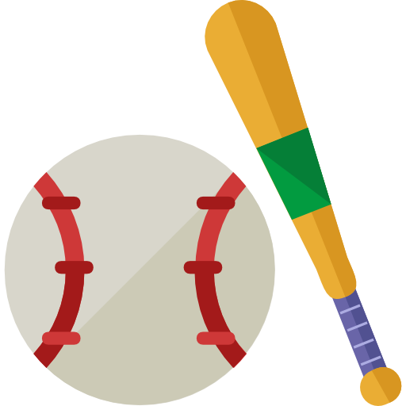

<!--
  ┌────────────────────────────────────────────────────────────────┐
  │  🧢 Jiwon Lee's Portfolio – README                               │
  │  Full‑stack dev · Baseball analytics · ML enthusiast            │
  └────────────────────────────────────────────────────────────────┘
-->

<div align="center">
  
  <h1>⚾ Jiwon Lee · Portfolio</h1>
  <p>
    <strong>Computer Science @ Western University</strong><br />
    Full‑stack development · Machine Learning · Sabermetrics
  </p>
  <p>
    <a href="[https://jiwonlee.tech](https://www.jiwon.tech/)" target="_blank">🌐 Live Demo</a> • 
    <a href="#-features">✨ Features</a> • 
    <a href="#-tech-stack">🛠️ Tech Stack</a> • 
    <a href="#-local-development">💻 Local Dev</a>
  </p>
  <p>
    
    
    
    
    
  </p>
</div>

---

## 🧢 About This Portfolio

A modern, interactive portfolio that showcases my journey as a **computer science student**, **full‑stack developer**, and **baseball analytics enthusiast**.  
Built with a clean design, smooth animations, and a **baseball‑bat cursor** that swings on click – because why not? 😄

**Live site:** [jiwonlee.dev](https://jiwonlee.dev) (deployed via Lovable / Vercel)

---

## ✨ Features

- ⚡ **Fully responsive** – works on desktop, tablet, and mobile.
- 🖱️ **Custom bat cursor** – follows your mouse, rotates in movement direction, and “swings” on click.
- 👀 **Scroll‑triggered animations** – fade‑in, slide‑in, and parallax effects.
- 🧩 **Western Webring integration** – connected to the Western CS community ring.
- 📁 **Project showcase** – includes RL (Pong), sentiment analysis, physics simulation, restaurant management, MLB prediction.
- 🎨 **Dark/Light mode ready** – uses HSL theming for easy customisation.
- 🧭 **Smooth scroll navigation** + **scroll‑to‑top button**.

---

## 🛠️ Tech Stack

| Area               | Technologies                                                                                   |
|--------------------|------------------------------------------------------------------------------------------------|
| **Frontend**       | React 18, TypeScript, Vite, Tailwind CSS, shadcn/ui components                                 |
| **Animations**     | CSS keyframes, Tailwind animations, Intersection Observer                                      |
| **Routing**        | React Router DOM                                                                               |
| **Icons**          | Lucide React                                                                                   |
| **UI Components**  | Radix UI primitives, Sonner (toasts), Recharts (charts – reserved)                             |
| **Deployment**     | Lovable / Vercel / Netlify (static)                                                            |

---

## 🧪 Featured Projects

| Project | Description | Tech |
|---------|-------------|------|
| 🏓 **PongRL** | Proximal Policy Optimization (PPO) on Atari Pong – curriculum vs direct training | Python, Gymnasium, RunPod |
| 🧠 **Sentimentrix** | Multimodal sentiment analysis on Reddit (text + images) using BERT & TF‑IDF | PyTorch, Transformers, scikit‑learn |
| ⚛️ **ROCsim** | GPU‑accelerated physics engine (AMD ROCm/HIP + CUDA) with Qt/OpenGL visualisation | C++, CUDA, HIP, CMake |
| 🍽️ **SPOT** | Real‑time restaurant order & table management system | React Native, Node, Supabase, PostgreSQL |
| ⚾ **MLB Predictor** | Sabermetric modelling (OPS, WAR, BABIP) with interactive comparisons | pandas, scikit‑learn, Matplotlib |

> All repositories are public on [my GitHub](https://github.com/JiwiKiwi19).

---

## 🚀 Local Development

1. **Clone the repository**  
   ```bash
   git clone https://github.com/JiwiKiwi19/jiwon-portfolio.git
   cd jiwon-portfolio
